<h1 align="center">DUNGEON BRAWL</h1>

<p align="center">
  <strong>A retro pixel-art party quiz game with strategic card-battling chaos</strong>
</p>

<p align="center">
  
  
  
  
</p>

---

<p align="center">
  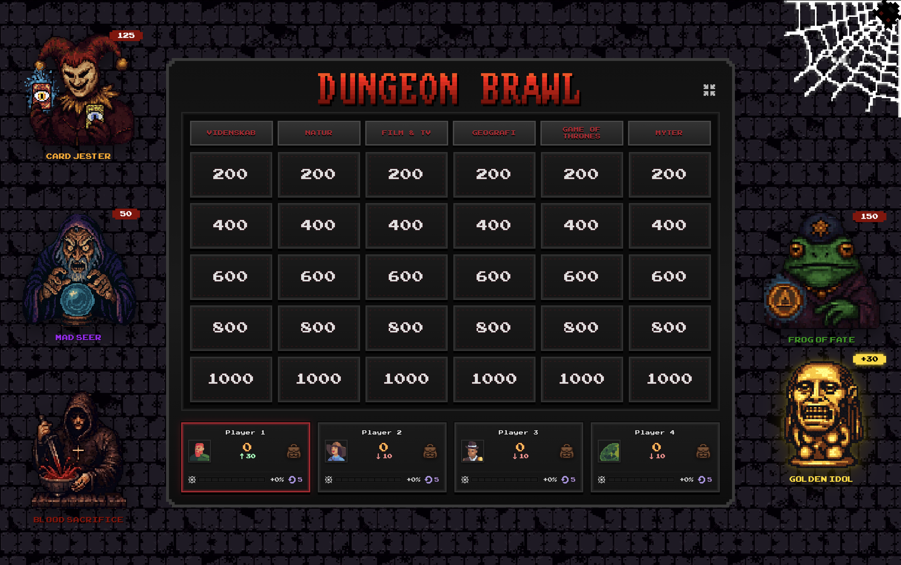
</p>

---

## What is Dungeon Brawl?

**Dungeon Brawl** combines the trivia challenge of Jeopardy with the strategic chaos of a card battler. Players take turns answering questions to earn points while using magical cards and dungeon actions to manipulate scores, steal from opponents, form alliances, and cause absolute mayhem.

Perfect for game nights, parties, or any gathering where you want knowledge *and* backstabbing.

---

## Features

### Jeopardy-Style Quiz Board
- Select questions from a grid of categories and point values
- Correct answers earn points, wrong answers deduct them
- Hidden multipliers (x2, x3) on random tiles for high-risk, high-reward gameplay

### 22 Unique Cards
Collect and play cards with powerful effects:

<table>
<tr>
<td align="center" width="120">
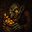<br/>
<strong>Loot Goblin</strong><br/>
<sub>Steal 200 points</sub>
</td>
<td align="center" width="120">
<br/>
<strong>Spiny Shell</strong><br/>
<sub>Hit 1st place for 20%</sub>
</td>
<td align="center" width="120">
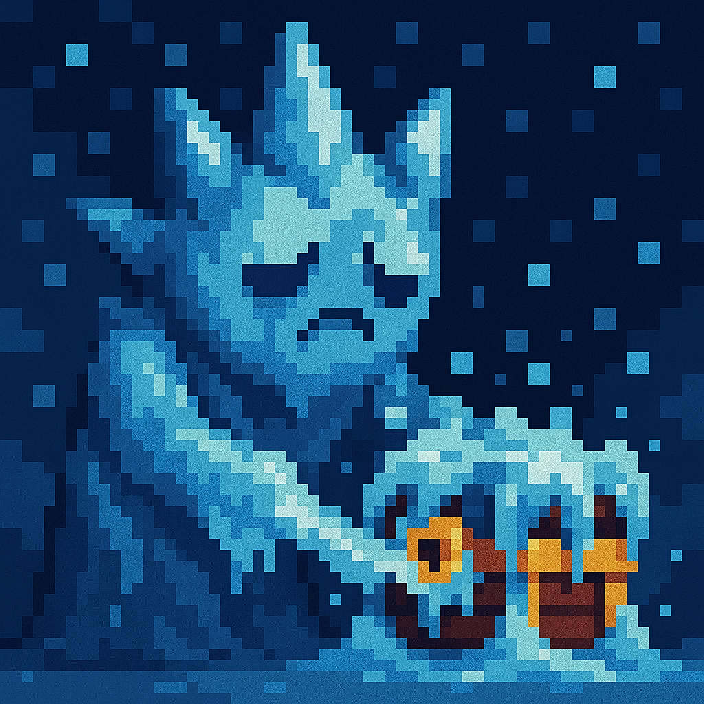<br/>
<strong>Glacial Elemental</strong><br/>
<sub>Freeze tiles or actions</sub>
</td>
<td align="center" width="120">
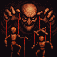<br/>
<strong>Puppet Master</strong><br/>
<sub>Force opponent's category</sub>
</td>
<td align="center" width="120">
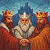<br/>
<strong>Coalition</strong><br/>
<sub>Form an alliance</sub>
</td>
</tr>
<tr>
<td align="center" width="120">
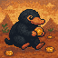<br/>
<strong>Niffler</strong><br/>
<sub>+25 points per turn</sub>
</td>
<td align="center" width="120">
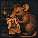<br/>
<strong>Thieving Rat</strong><br/>
<sub>Steal a random card</sub>
</td>
<td align="center" width="120">
<br/>
<strong>Roulette</strong><br/>
<sub>Gamble up to 500 pts</sub>
</td>
<td align="center" width="120">
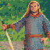<br/>
<strong>Martin</strong><br/>
<sub>Receive a Quest</sub>
</td>
<td align="center" width="120">
<br/>
<strong>Tick</strong><br/>
<sub>Drains 1% per turn</sub>
</td>
</tr>
</table>

### Dungeon Actions
Special abilities available during your turn:

| Action | Effect |
|--------|--------|
| **Card Jester** | Pay 200 pts to buy a random card |
| **Mad Seer** | Pay 100 pts to peek at a hidden tile |
| **Blood Sacrifice** | Lose 100 pts to gain a card |
| **Frog of Fate** | 50/50 gamble: win or lose 100 pts |
| **Golden Idol** | Claim a shared pot that grows each turn |
| **The Spider** | Feed items to gain multipliers and rerolls |

### Quest System
Complete objectives from the quest-giver Martin to unlock permanent upgrades:
- Sacrifice health to upgrade Blood Sacrifice
- Use the Mad Seer 5 times for free reveals
- Answer 3 questions correctly for gold and cards
- And more...

### AI Quiz Generation
Generate custom quizzes instantly using Google's Gemini AI:
- Enter category names and descriptions
- AI generates 5 questions per category
- Save generated quizzes for future games

### Black Market
At the start of each turn, choose from randomly offered cards to build your inventory.

### Alliances & Betrayal
Form temporary alliances with the Coalition card. Allied players cannot harm each other... until the alliance expires.

---

## How to Play

### Setup
1. **Choose a Quiz** - Select from built-in quizzes, create your own, or generate one with AI
2. **Add Players** - 2-8 players with customizable names and pixel art portraits
3. **Configure Settings** - Adjust point values, card weights, and game mechanics

### Gameplay
1. **Black Market** - Choose cards offered at turn start
2. **Use Actions** - Play cards or use dungeon actions before answering
3. **Select a Tile** - Pick a category and point value
4. **Answer** - The Game Master reads the question and judges your answer
5. **Score** - Earn or lose points based on your answer

### Winning
The player with the highest score when all tiles are cleared wins!

---

## Installation

### Play Online
Visit: **[https://fvhreimert.github.io/dungeon-brawl/](https://fvhreimert.github.io/dungeon-brawl/)**

### Run Locally

```bash
# Clone the repository
git clone https://github.com/fvhreimert/dungeon-brawl.git
cd dungeon-brawl

# Install dependencies
npm install

# Start development server
npm run dev
```

### Build for Production

```bash
npm run build
npm run preview
```

### Desktop App (Tauri)

```bash
# Development
npm run tauri:dev

# Build executable
npm run tauri:build
```

---

## Tech Stack

- **Frontend**: React 19 + TypeScript
- **Styling**: Tailwind CSS + Custom pixel art CSS
- **Build Tool**: Vite 6
- **Desktop**: Tauri 2.0
- **AI Generation**: Google Gemini API
- **Fonts**: Press Start 2P, November, Arcade Classic

---

## Creating Custom Quizzes

### In-Game Editor
Use the built-in quiz builder to create custom quizzes with:
- Custom category names
- 5 questions per category
- Save locally or export as JSON

### AI Quiz Generation

Generate unlimited custom quizzes using Google's Gemini AI:

#### Getting Your Free API Key
1. Go to [Google AI Studio](https://aistudio.google.com)
2. Sign in with your Google account
3. Click "Get API Key" in the left sidebar
4. Create a new API key (it's free!)
5. Copy the key - it starts with `AIza...`

#### Generating a Quiz
1. Click **"Generate Quiz"** from the main menu
2. Paste your API key (it's saved locally for future use)
3. Click **"Continue"** to verify the key works
4. Enter category names (e.g., "80s Movies", "World Geography", "Video Games")
5. Optionally add descriptions to guide the AI (e.g., "Focus on horror films")
6. Click **"Generate"** - your quiz is ready in seconds!

Generated quizzes are automatically saved and appear in your quiz library for future games

### Import/Export
- Export quizzes as JSON files to share
- Import JSON quiz files from others

---

## Game Master Tips

Dungeon Brawl is designed as a party game with a **Game Master** who:
- Controls the computer/TV
- Reads questions aloud
- Judges answers (correct/wrong)
- Executes player commands
- Narrates the chaos!

This creates a lively game-show atmosphere where table-talk, negotiation, and bluffing are just as important as trivia knowledge.

---

## Card Categories

| Type | Examples | Description |
|------|----------|-------------|
| **Passive** | Niffler, Tick, Beggar | Auto-trigger each turn |
| **Offensive** | Loot Goblin, Spiny Shell | Attack other players |
| **Utility** | Traveling Merchant, Martin | Gain cards or quests |
| **Gamble** | Roulette, Price Cracker | Risk vs reward |
| **Items** | Shovel, Compass, Treasure Map | Collect sets for treasure |
| **Defensive** | Soul Burst, Coalition | Protect yourself |

---

<p align="center">
  <strong>Good luck, adventurer. May your knowledge be vast and your cards be wild.</strong>
</p>

<p align="center">
  
  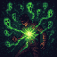
  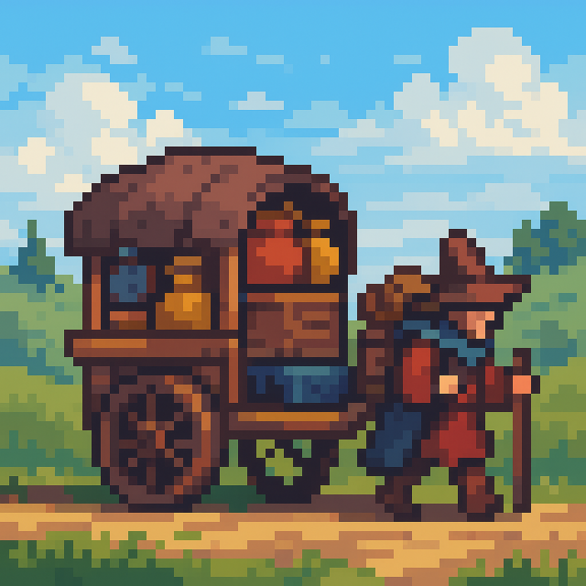
  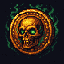
  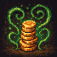
</p>
